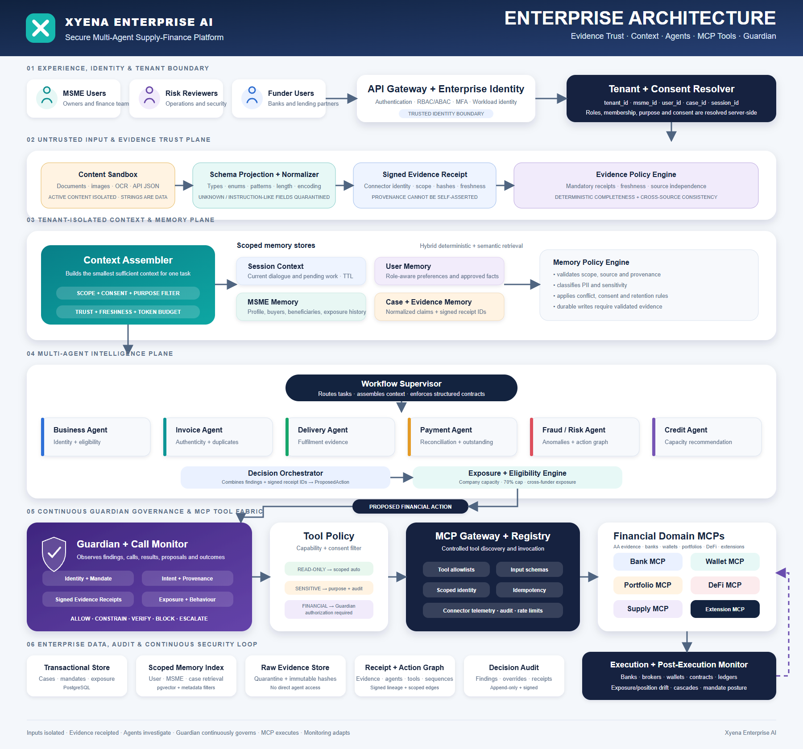

# XYENA Enterprise AI

Secure, multi-agent supply-finance orchestration with continuous Guardian governance.

> **XYENA determines whether an MSME receivable is genuine and financeable. Guardian determines whether the resulting AI-generated financial action is safe and authorized to execute.**

## Project status

The Xyena core backend, Guardian authorization plane, MCP registry/broker, agent runtime, scoped
context and memory, user-data services, migrations, containers and deployment manifests are
implemented.

Isolated synthetic Bank, GST/e-Invoice, Buyer ERP, Delivery, Funder Marketplace and Business
Registry demonstrations are implemented under `demos/`. They provide database-backed operational
workflows and narrow MCP evidence without connecting to a real financial institution, government
system or production ERP. Full Account Aggregator, Ledger/Payment and the remaining external
applications remain implementation specifications rather than runnable services.

See [Backend Implementation Status](./docs/backend-architecture/IMPLEMENTATION_STATUS.md) for the
delivered checkpoints, deployment gates and explicit exclusions.

## Implemented runtime

| Component | Capability |
|---|---|
| `apps/api` | authenticated sessions, conversations, runs, approvals, memory and user-data APIs |
| `apps/worker` | durable agent jobs, approval resume, embeddings, recovery and outbox delivery |
| `apps/mcp_server` | hosted MCP, reviewed remote discovery, canonical broker and Guardian-routed calls |
| `apps/guardian` | deterministic policy, approvals and single-use exact-request authorization |
| `demos/bank-mcp` | synthetic bank evidence/preparation MCP service and light operations frontend |
| `demos/gst-portal` | synthetic GST/e-Invoice workflow, multi-page portal and read-only evidence MCP |
| `demos/buyer-erp` | synthetic purchase-order, receipt, invoice-matching and acceptance evidence |
| `demos/delivery-mcp` | synthetic delivery/fulfilment status and proof evidence MCP service |
| `demos/funder-marketplace` | synthetic funding programs, offers, reservations and commitments |
| `demos/business-registry` | synthetic legal identity, ownership and relationship evidence registry |
| `migrations/versions` | PostgreSQL/pgvector schemas and tenant row-level security |

For local core configuration and deployment, start with `.env.example`, `compose.yaml` and the
[backend architecture](./docs/backend-architecture/README.md). Independent setup instructions are
available for the [bank demo](./demos/bank-mcp/README.md),
[GST portal](./demos/gst-portal/README.md), [Buyer ERP](./demos/buyer-erp/README.md),
[Delivery](./demos/delivery-mcp/README.md),
[Funder Marketplace](./demos/funder-marketplace/README.md) and
[Business Registry](./demos/business-registry/README.md).

## The problem

MSMEs frequently deliver goods or services before receiving payment. The resulting 30–90 day receivable period can create a working-capital gap.

Financing that receivable requires more than checking an uploaded invoice. A trustworthy system must determine:

- whether the business and buyer are genuine;
- whether the invoice exists in an authoritative system;
- whether the underlying goods or services were delivered;
- whether the receivable remains unpaid;
- whether the beneficiary is legitimate;
- how much aggregate exposure already exists;
- how much financing can safely be provided;
- whether an AI-generated financial action is authorized and safe.

An authenticated AI agent can still attempt an unsafe action because of prompt-injected documents, poisoned API data, compromised tools, counterparty impersonation, abnormal behaviour, excessive exposure, or unintended action chains.

Therefore:

> **Technical transaction validity is not the same as legitimate agent intent.**

## Solution overview

XYENA combines:

1. tenant-isolated context and memory;
2. specialized evidence and risk agents;
3. controlled MCP access to external systems;
4. signed, non-self-assertable evidence receipts;
5. deterministic financing and exposure controls;
6. an independent Guardian authorization layer;
7. hash-bound financial execution;
8. continuous post-execution monitoring and reconciliation.

## Enterprise architecture



The complete architecture is documented in [Enterprise Architecture](./docs/ENTERPRISE_ARCHITECTURE.md).

### Operating principle

```text
Untrusted inputs are isolated
        ↓
Evidence is normalized and receipted
        ↓
Agents investigate independently
        ↓
Decision Orchestrator proposes an exact action
        ↓
Guardian allows, constrains, verifies, blocks or escalates
        ↓
Execution Gateway invokes an authorized MCP tool
        ↓
Monitoring reconciles the outcome and updates risk posture
```

## Evidence trust boundary

Uploaded files, OCR text, emails, API JSON and tool-returned strings are always treated as untrusted data—even when delivered through an authenticated connector.

```text
Untrusted document or external payload
        ↓
Content sandbox
        ↓
Strict schema projection and normalization
        ↓
Invalid/instruction-like fields quarantined
        ↓
Raw and normalized hashes generated
        ↓
Gateway-signed EvidenceReceipt
        ↓
Deterministic completeness and consistency checks
```

Users, documents, external JSON and agents cannot label their own evidence as trusted. Domain findings must cite valid gateway-issued `evidence_receipt_id` values.

## Multi-agent system

| Agent | Responsibility |
|---|---|
| Intake Agent | Establishes case scope, consent and required evidence |
| Business Agent | Verifies business identity, registration and eligibility |
| Invoice Agent | Verifies invoice authenticity, value and duplicates |
| Delivery Agent | Verifies fulfilment and supported delivered value |
| Payment Agent | Reconciles payments and calculates the outstanding amount |
| Fraud/Risk Agent | Detects anomalies, collusion, injection and dangerous graphs |
| Credit Agent | Recommends safe financing capacity |
| Decision Orchestrator | Combines findings into a canonical proposed action |
| Funding Agent | Selects a funder and prepares the exact disbursement |
| Guardian Agent | Governs calls and authorizes or refuses exact actions |
| Monitoring Agent | Reconciles outcomes and detects behavioural/action drift |

Each agent has its own detailed contract under [docs/agents](./docs/agents/README.md).

Domain agents investigate and prepare actions. They cannot directly execute money movement.

## Financing controls

```text
Available Company Capacity
= Dynamic Company Limit − Existing Aggregate Exposure

Receivable Maximum
= Verified Outstanding Receivable × 70%

Final Financing Amount
= MIN(
    Available Company Capacity,
    Receivable Maximum,
    Other Applicable Policy Limits
  )
```

Aggregate exposure includes all participating banks, lenders and funders—not only the currently selected provider.

## Guardian

Guardian continuously observes meaningful:

- agent findings;
- tool requests and results;
- evidence receipts and security flags;
- proposed actions;
- authorization attempts;
- execution outcomes;
- behavioural and action-chain changes.

Sensitive reads, state changes and financially consequential actions are synchronously governed.

Guardian checks:

- agent/workload identity;
- active authority and mandate;
- tenant, organization, user and case scope;
- action intent and instruction provenance;
- signed evidence receipt validity and freshness;
- required evidence completeness and consistency;
- counterparty and beneficiary identity;
- exposure and domain policy;
- behaviour, velocity and action sequences;
- exact destination, amount, asset, venue and method.

Guardian returns:

| Decision | Meaning |
|---|---|
| `ALLOW` | Execute the exact proposed action |
| `CONSTRAIN` | Execute only within safer parameters |
| `VERIFY` | Obtain additional evidence or confirmation |
| `BLOCK` | Refuse the action |
| `ESCALATE` | Require a human/security reviewer |

An `ALLOW` or `CONSTRAIN` decision can issue a short-lived, single-use authorization bound to the canonical action hash. Changing the amount, beneficiary, account, asset, chain, contract, order or venue invalidates the authorization.

## Financial Domain MCP servers

Guardian is domain-agnostic. Supply finance is the first implementation.

| MCP server | Evidence capabilities | Protected capabilities |
|---|---|---|
| Bank MCP | Account Aggregator, accounts, transactions, beneficiaries and limits | transfers, holds, reversals and beneficiary changes |
| Wallet MCP | chain state, balances, address intelligence and allowances | transfers, approvals, bridges and signing |
| Portfolio MCP | holdings, positions, market data and mandates | orders, cancellations, rebalancing and collateral |
| DeFi MCP | protocol, contract, oracle and simulation evidence | swaps, lending, staking, liquidity and contract calls |
| Supply MCP | business, GST, invoice, ERP, delivery, risk and funder evidence | controlled case/funding preparation |
| Extension MCP | cards, lending, insurance, treasury, FX and trade finance | registered domain-specific actions |

See:

- [Financial Domain Adapter Architecture](./docs/FINANCIAL_DOMAIN_ADAPTERS.md)
- [Bank MCP Server](./docs/BANK_MCP.md)
- [Bank MCP Configuration](./docs/BANK_MCP_CONFIG.md)

### Account Aggregator boundary

The Account Aggregator is a consented, read-only evidence connector behind Bank MCP. It is not the payment-execution path.

```text
Account Aggregator connector → consented financial evidence
Bank/payment connector       → Guardian-authorized execution
```

## External live demo applications

The target demonstration environment uses independent, database-backed applications on separate
subdomains. Implemented rows link to their runnable application folders; remaining rows are build
specifications.
When implemented, updates must persist, emit transactional events, refresh connected UIs and
immediately affect MCP results.

| Application | Example subdomain | Status | Specification |
|---|---|---|---|
| Business Registry | `registry.demo.xyena.ai` | implemented | [Registry app](./demos/business-registry/README.md) |
| GST and e-Invoice | `gst.demo.xyena.ai` | implemented | [GST/e-Invoice app](./demos/gst-portal/README.md) |
| Buyer and ERP | `erp.demo.xyena.ai` | implemented | [Buyer/ERP app](./demos/buyer-erp/README.md) |
| Delivery and Fulfilment | `delivery.demo.xyena.ai` | implemented | [Delivery app](./demos/delivery-mcp/README.md) |
| Synthetic Bank MCP | `bank.demo.xyena.ai` | implemented | [Bank demo](./demos/bank-mcp/README.md) |
| Bank and Account Aggregator target | `bank.demo.xyena.ai` | specified | [Bank/AA app](./docs/ext-demo/BANK_AA_APP.md) |
| Funder Marketplace | `funder.demo.xyena.ai` | implemented | [Funder app](./demos/funder-marketplace/README.md) |
| Ledger and Payment Operations | `ledger.demo.xyena.ai` | specified | [Ledger app](./docs/ext-demo/LEDGER_PAYMENT_APP.md) |

Start with the [External Demo Suite Overview](./docs/ext-demo/README.md) and [Shared Platform Requirements](./docs/ext-demo/SHARED_PLATFORM_REQUIREMENTS.md).

### Live data propagation

```text
Authorized data update
        ↓
Application database transaction
        ├── domain record update
        ├── immutable audit event
        └── transactional outbox event
        ↓
SSE refreshes connected browser screens
        ↓
MCP reads return the new committed version
        ↓
Other applications consume signed, idempotent events
        ↓
XYENA invalidates stale evidence and reevaluates affected cases
```

## Context and isolation

Every context item, memory item, evidence receipt, finding, tool call, proposal, decision and execution result is scoped by:

```text
tenant_id
└── msme_id / subject_id
    ├── user_id
    │   └── session_id
    └── case_id
        ├── evidence_snapshot_id
        ├── agent_run_id
        ├── proposed_action_id
        └── guardian_decision_id
```

Memory can assist reasoning but cannot establish identity, approve a beneficiary, create a mandate or authorize a transaction.

## Repository structure

```text
apps/
├── api/                   # identity, sessions and orchestration entry point
├── guardian/              # independent authorization plane
├── mcp_server/            # MCP registry, broker and hosted tools
├── web/                   # web experience
└── worker/                # durable agent and operations jobs

demos/
└── bank-mcp/              # synthetic bank MCP service and frontend

packages/
├── agents/                # agent implementations and Guardian
├── context/               # trusted scope and ContextEnvelope assembly
├── contracts/             # shared schemas and canonical action contracts
├── evidence/              # sandboxing, normalization and signed receipts
├── memory/                # scoped memory and retrieval policy
├── tools/                 # connector adapters and MCP clients
└── policies/              # deterministic evidence and financial policies

tests/
├── contracts/
├── isolation/
├── security/
├── integration/
└── scenarios/

docs/
├── agents/
├── ext-demo/
└── architecture and MCP specifications
```

External-demo specifications remain under `docs/ext-demo`; implemented applications have matching
runtime directories under `demos/`.

## Documentation

### Core idea and architecture

- [Combined XYENA Idea](./docs/XYENA_AI_Combined_Idea.md)
- [Agent Handoff Idea](./AGENT_IDEA.md)
- [Enterprise Architecture](./docs/ENTERPRISE_ARCHITECTURE.md)
- [Original Architecture Overview](./docs/ARCHITECTURE.md)
- [Validated Mermaid Source](./docs/xyena-enterprise-architecture.mmd)
- [Architecture SVG](./docs/xyena-enterprise-architecture.svg)
- [Architecture PNG](./docs/xyena-enterprise-architecture.png)
- [Problem Statement 8](./docs/Problem_Statement_8.pdf)

### Agents and tools

- [Agent Documentation Index](./docs/agents/README.md)
- [Financial Domain Adapters](./docs/FINANCIAL_DOMAIN_ADAPTERS.md)
- [Bank MCP Specification](./docs/BANK_MCP.md)
- [Bank MCP Configuration Guide](./docs/BANK_MCP_CONFIG.md)

### External demo systems

- [External Demo Application Suite](./docs/ext-demo/README.md)
- [Shared External Platform Requirements](./docs/ext-demo/SHARED_PLATFORM_REQUIREMENTS.md)
- [Combined GST and Delivery Overview](./docs/DEMO_GST_DELIVERY_PLATFORM.md)

## Recommended implementation order

### Phase 1 — Shared contracts and trust boundary

- trusted scope envelope;
- agent finding and proposed-action schemas;
- content sandbox and evidence normalization;
- signed EvidenceReceipt contract;
- tool policy and MCP Gateway;
- append-only audit and event outbox.

### Phase 2 — Live external evidence applications

- Business Registry;
- GST/e-Invoice;
- Buyer/ERP;
- Delivery/Fulfilment;
- cross-application events and MCP tools.

### Phase 3 — Supply-finance agents

- Intake, Business, Invoice, Delivery and Payment agents;
- Fraud/Risk and Credit agents;
- deterministic completeness, consistency, exposure and eligibility engines;
- Decision Orchestrator.

### Phase 4 — Bank MCP and financial execution

- Bank/AA application;
- Funder Marketplace;
- Ledger/Payment Operations;
- Funding Agent;
- Guardian exact-action authorization;
- idempotency, reservation and reconciliation.

### Phase 5 — Security scenarios and domain expansion

- document and JSON prompt injection;
- fabricated provenance;
- beneficiary impersonation;
- duplicate financing and cascading actions;
- Wallet, Portfolio and DeFi MCP prototypes.

## First end-to-end demonstration

The first complete scenario should show:

1. an MSME and buyer exist in the Registry app;
2. the ERP app contains an approved purchase order;
3. the GST app contains a registered invoice;
4. the Delivery app contains accepted fulfilment;
5. the Bank/AA app provides consented transaction evidence;
6. agents independently verify the case;
7. the exposure engine constrains the safe amount;
8. the Funder app reserves an offer;
9. Guardian authorizes the exact disbursement;
10. Bank MCP and the Ledger app execute/reconcile it once;
11. every UI and MCP result reflects the updated committed state;
12. the complete evidence and action chain remains auditable.

The attack version should inject malicious instructions or contradictory evidence and visibly produce `VERIFY`, `CONSTRAIN`, `BLOCK` or `ESCALATE` before funds move.

## Security and demonstration disclaimer

This project is an architecture and demonstration environment. It is not a licensed bank, Account Aggregator, GST portal, payment system, lender, broker, custodian or DeFi execution service. Demo applications must use synthetic data and non-production credentials until the required legal, regulatory, security and operational controls are independently established.
