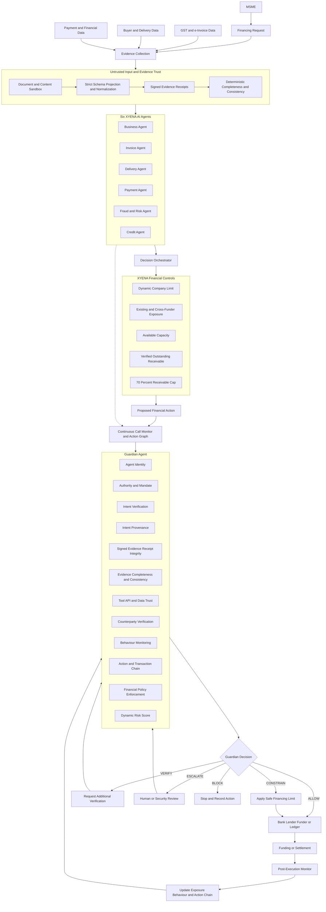
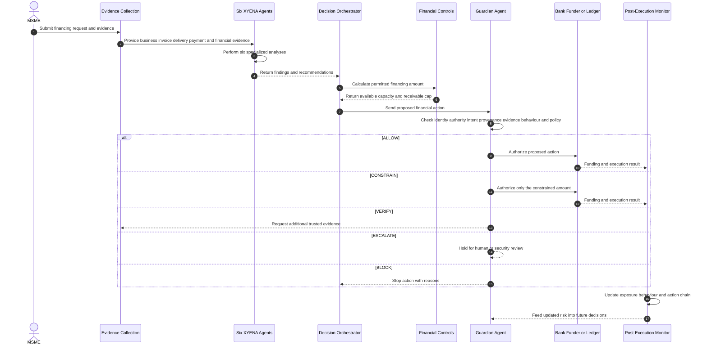

# XYENA AI Architecture

> Backend implementation detail: see [Xyena + Guardian Core Backend Architecture](./backend-architecture/README.md), including the phased Python/PostgreSQL plan and OpenAPI/MCP contracts.

## 1. Architecture goal

XYENA AI is a secure autonomous supply-finance orchestration platform. It verifies an MSME receivable, determines how much financing can safely be provided, governs the AI-generated financial action, and monitors the result after execution.

The central separation of responsibility is:

> The six XYENA agents investigate. The Decision Orchestrator proposes. Guardian governs. The bank, lender, funder, or ledger executes.

## 2. Complete architecture



## 3. Architecture layers

### Layer 1 — Evidence and verification

This layer determines whether the financing request and underlying receivable are trustworthy. Uploaded artifacts and external API payloads enter as untrusted data. They are sandboxed, schema-projected, normalized, security-classified, hashed, and bound to gateway-signed evidence receipts before an agent can cite them.

| Component | Responsibility |
|---|---|
| Business Agent | Verifies business identity, registration, consistency, and eligibility |
| Invoice Agent | Verifies invoice authenticity, value, buyer details, and duplicate indicators |
| Delivery Agent | Verifies fulfilment and consistency between delivery and invoice |
| Payment Agent | Reconciles payments and calculates the outstanding receivable |
| Fraud/Risk Agent | Detects anomalies, suspicious patterns, collusion, circular trading, and duplicate financing |
| Credit Agent | Evaluates financing capacity and recommends an amount |

The six agents return structured findings that cite signed `evidence_receipt_id` values. A document, agent, user, or JSON field cannot self-assert trusted provenance. The agents do not independently authorize or execute money movement.

### Layer 2 — Financing decision

The Decision Orchestrator combines the six agent findings and produces a proposed financing action.

```text
Business finding
Invoice finding
Delivery finding
Payment finding
Fraud/Risk finding
Credit recommendation
        ↓
Decision Orchestrator
        ↓
Proposed financing action
```

The financing amount is constrained by XYENA's financial controls:

```text
Available Company Capacity
= Dynamic Company Limit - Existing Aggregate Exposure

Receivable Maximum
= Verified Outstanding Receivable × 70%

Final Financing Amount
= MIN(
     Available Company Capacity,
     Receivable Maximum,
     Other Applicable Policy Limits
   )
```

All banks, lenders, and funders contribute to one aggregate exposure view for the MSME.

### Layer 3 — Agent governance

Guardian is an independent automated maker-checker. It continuously consumes trusted telemetry for meaningful agent findings, tool requests, tool results, proposals, and outcomes. It synchronously intercepts sensitive and financially consequential actions and decides whether they are trustworthy enough to reach financial infrastructure.

Guardian checks:

1. the identity and active status of the requesting agent;
2. whether the action is inside the agent's authority and mandate;
3. whether the action matches the intended financing purpose;
4. where the intent or instruction originated;
5. whether cited evidence receipts have valid signatures, hashes, scope, freshness, connector identity, and security flags;
6. whether required evidence is complete and normalized claims are consistent across independent sources;
7. whether external tools, APIs, and data sources are trustworthy;
8. whether the beneficiary or counterparty is expected;
9. whether the agent's amount, frequency, destination, or sequence is abnormal;
10. whether connected actions form a dangerous transaction chain;
11. whether exposure, receivable caps, and other financial policies are satisfied.

Guardian returns one of five decisions:

| Decision | Result |
|---|---|
| `ALLOW` | Execute the proposed action autonomously |
| `CONSTRAIN` | Reduce the action to the permitted amount or scope |
| `VERIFY` | Request stronger evidence or counterparty confirmation |
| `BLOCK` | Stop the action before financial execution |
| `ESCALATE` | Send the action and evidence to a human or security reviewer |

## 4. End-to-end flow



## 5. Pre-execution governance

Guardian is the final checkpoint before an action reaches a bank, lender, funder, payment system, or ledger.

```text
Proposed Action
      ↓
Identity
      ↓
Authority and Mandate
      ↓
Intent and Intent Provenance
      ↓
Evidence and Context Integrity
      ↓
Counterparty and Tool Trust
      ↓
Behaviour and Action Chain
      ↓
Exposure and Financial Policy
      ↓
Risk Score
      ↓
ALLOW / CONSTRAIN / VERIFY / BLOCK / ESCALATE
```

Every decision produces an explainable record containing the action, requesting agent, intent, risk score, decision, reason signals, evidence references, and timestamp.

## 6. Post-execution monitoring

Post-execution monitoring closes the security loop after an action is approved or executed.

It monitors:

- actual execution compared with approved amount and beneficiary;
- new actions generated after funding;
- updated company and cross-funder exposure;
- changes in agent behaviour;
- cascading or repeated financing activity;
- emerging suspicious tools, instructions, destinations, or counterparties.

The result feeds back into Guardian so the agent's autonomy can move from autonomous to verified, constrained, blocked, or escalated as risk changes.

```text
OBSERVE
  ↓
UNDERSTAND INTENT
  ↓
VERIFY AUTHORITY
  ↓
ASSESS CONTEXT AND RISK
  ↓
ENFORCE POLICY
  ↓
EXECUTE OR STOP
  ↓
MONITOR
  ↓
ADAPT
  ↺
```

## 7. Critical security scenarios

| Scenario | Architectural control |
|---|---|
| Fake or forged invoice | Invoice, delivery, buyer, payment, fraud, and evidence-consistency checks |
| Duplicate financing | Receivable identity, financing history, aggregate cross-funder exposure, and action graph |
| Buyer-seller collusion | Counterparty graph, delivery evidence, history, and fraud signals |
| Circular trading | Transaction graph and circular sequence detection |
| Beneficiary swap | Counterparty history, destination verification, and Guardian pre-execution check |
| Prompt injection in invoice | sandboxing, instruction/data separation, field quarantine, least privilege, and signed evidence receipts |
| Prompt or field injection in GST/API JSON | strict schema projection, enum/pattern/length checks, untrusted-string labels, and no direct raw-payload prompting |
| Fabricated provenance | gateway-only receipt issuance, signed scope/hash binding, and receipt-store lookup |
| Poisoned external data | authenticated connectors, immutable raw hashes, response-drift monitoring, and cross-source consistency checks |
| Compromised tool or API | tool identity, signed output provenance, circuit breaking, independent corroboration, and evidence comparison |
| Abnormal agent behaviour | Behaviour baseline, dynamic risk, and reduced autonomy |
| Cascading actions | Action-chain analysis, cumulative exposure, and post-execution monitoring |

## 8. Prototype boundary

The prototype should implement the complete XYENA decision and governance flow while simulating external financial infrastructure.

### Build

- financing request and evidence collection;
- sandboxed document/API ingestion, strict normalization, and signed evidence receipts;
- six-agent verification workflow;
- Decision Orchestrator;
- dynamic company and cross-funder exposure;
- 70% receivable cap;
- Guardian checks and risk decisions;
- mock bank, funder, or ledger;
- post-execution monitoring;
- explainable decision records;
- normal, constrained, document-injection, JSON-field-injection, fabricated-provenance, beneficiary-swap, and cascade scenarios.

### Simulate

- real bank integration and real fund transfer;
- production authentication and multi-tenancy;
- complete regulatory infrastructure;
- production-scale machine-learning models;
- public or decentralized funding channels.
