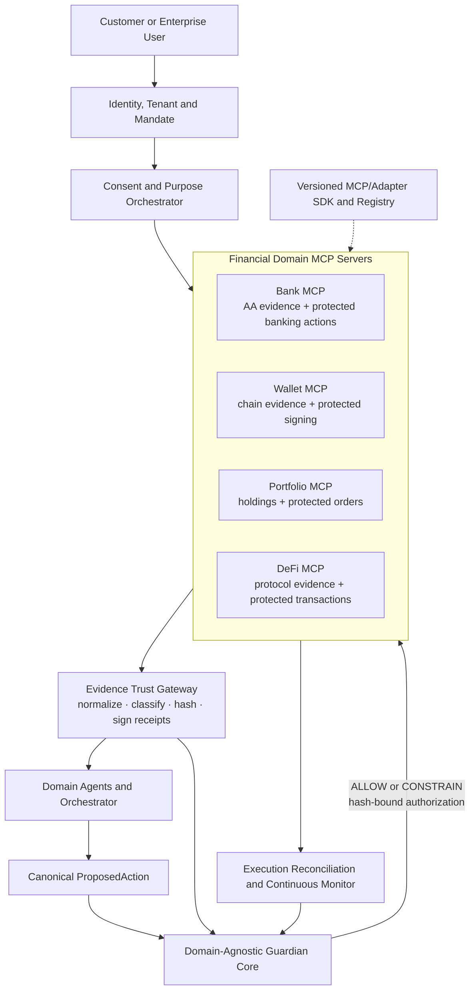

# XYENA Guardian — Financial Domain Adapter Architecture

## 1. Purpose

Guardian is a domain-agnostic security and governance core for autonomous financial agents. XYENA Supply Finance is the first product built on that core, not the limit of the platform.

The platform separates three responsibilities:

```text
Evidence acquisition       → What is true?
Domain decisioning         → What action is appropriate?
Guardian governance        → Is this exact action safe and authorized?
```

Financial products are exposed to agents through domain MCP servers. Each MCP server uses internal domain adapters to translate identities, assets, evidence, actions, simulations, risks, and execution receipts into shared Guardian contracts.

```text
Agents → MCP Gateway → Domain MCP Server → Domain adapters → External systems
```

This gives agents a consistent, discoverable tool interface while keeping credentials, connectors, raw responses, policy enforcement, and execution authority on the server side.

---

## 2. Account Aggregator Is an Evidence Adapter

For the Indian Account Aggregator model, XYENA acts as or through an eligible Financial Information User and receives customer-consented information through an Account Aggregator and Financial Information Providers.

The AA path is read-only:

```text
Customer
   ↓ explicit purpose-bound consent
Consent Orchestrator
   ↓ verifiable consent artefact
Account Aggregator Adapter
   ↓ secure request
Financial Information Providers
   ↓ digitally signed financial information
Evidence Trust Gateway
   ↓ normalized claims + signed XYENA evidence receipts
Agents and Guardian
```

The AA adapter can obtain consented evidence from supported financial-information providers such as banks, NBFCs, asset-management/depository participants, insurers, pension recordkeepers, GSTN, and other permitted participants.

The AA adapter must not be used to initiate payments, trades, reversals, wallet transfers, or DeFi transactions. RBI's Account Aggregator directions state that an AA shall not support customer transactions. Account Aggregator information does not reside with the AA, and access is governed by explicit, auditable consent. See the [RBI NBFC–Account Aggregator Master Directions](https://systemhealth.rbi.org.in/Scripts/BS_ViewMasDirections.aspx_id%3D10598%281%29.html).

### AA adapter responsibilities

- create, verify, expire, and revoke purpose-bound consent references;
- bind requested data ranges and data types to tenant, user, MSME, and case scope;
- authenticate the AA/FIP communication path;
- verify upstream signatures and consent use;
- reject responses outside the requested consent scope;
- route encrypted/raw responses to the Evidence Trust Gateway;
- emit call telemetry and consent-use events to Guardian;
- never expose customer credentials to agents;
- never treat AA data as a payment instruction or execution mandate.

---

## 3. Bank MCP Server and Banking/Payment Adapters

The Bank MCP Server presents one controlled banking tool surface. Internally, its Banking and Payment adapters are separate from the Account Aggregator connector and handle financially consequential actions only after Guardian authorization. The complete tool catalogue is defined in [BANK_MCP.md](./BANK_MCP.md).

### Evidence capabilities

- account ownership and status;
- beneficiary verification;
- balances and transaction history where permitted;
- payment and settlement status;
- account, rail, currency, and transaction limits.

### Action capabilities

- `BANK_TRANSFER`;
- `DISBURSE_FUNDS`;
- `REVERSE_PAYMENT`;
- `ADD_OR_CHANGE_BENEFICIARY`;
- `PLACE_OR_RELEASE_HOLD`;
- `SETTLE_RECEIVABLE`.

### Guardian checks

- account and beneficiary identity;
- agent and user mandate;
- purpose and amount limits;
- new-beneficiary and account-change risk;
- duplicate, replay, velocity, and unusual-destination risk;
- available balance and aggregate exposure;
- exact rail and currency;
- idempotency and reconciliation state.

Every executable instruction must use a short-lived, single-use authorization bound to the exact action hash, account, beneficiary, amount, currency, rail, case, and expiry.

---

## 4. Wallet and Digital-Asset Adapter

The Wallet Adapter supports custodial wallets, approved institutional wallets, and user-controlled wallets without exposing seed phrases or private keys to an agent.

### Evidence capabilities

- wallet ownership proof through an approved signature challenge;
- chain, network, address, asset, balance, nonce, and transaction history;
- destination address reputation and counterparty labels;
- token holdings and active allowances;
- bridge, mixer, sanctions, address-poisoning, and dusting signals;
- custodial account status and withdrawal controls.

### Action capabilities

- `WALLET_TRANSFER`;
- `TOKEN_TRANSFER`;
- `APPROVE_TOKEN_ALLOWANCE`;
- `REVOKE_TOKEN_ALLOWANCE`;
- `SIGN_TRANSACTION`;
- `BRIDGE_ASSET`.

### Guardian checks

- correct chain and chain ID;
- wallet ownership and signer mandate;
- checksum-normalized exact destination;
- lookalike/address-poisoning detection;
- token contract identity, decimals, amount, and valuation;
- nonce, gas, fee, slippage, and deadline bounds;
- transfer and withdrawal velocity;
- destination and fund-flow risk;
- transaction simulation before signing;
- hardware wallet, MPC, custody, or human confirmation requirements.

Guardian authorizes the canonical transaction intent. A separate signer or custody service performs signing; agents never receive raw private keys.

---

## 5. Portfolio and Brokerage Adapter

The Portfolio Adapter supports holdings analysis and governed order placement across brokers, custodians, depositories, and portfolio-management systems.

AA may provide consented portfolio evidence where supported, but order execution must use a separate regulated broker/exchange adapter.

### Evidence capabilities

- cash, holdings, positions, cost basis, and realized/unrealized gains;
- open orders and recent executions;
- asset class, issuer, sector, country, currency, liquidity, and volatility;
- leverage, margin, collateral, and concentration;
- investment mandate, restrictions, and approved universe.

### Action capabilities

- `PLACE_ORDER`;
- `CANCEL_ORDER`;
- `REBALANCE_PORTFOLIO`;
- `LIQUIDATE_POSITION`;
- `MOVE_COLLATERAL`;
- `EXERCISE_CORPORATE_ACTION`.

### Guardian checks

- portfolio owner, account, and investment mandate;
- instrument identity and market venue;
- order side, type, quantity, price, time-in-force, and expiry;
- pre/post-trade concentration and liquidity;
- leverage, margin, drawdown, and loss limits;
- restricted securities and approved universe;
- abnormal strategy drift or excessive turnover;
- stale prices, market impact, and contradictory valuation sources;
- duplicate and unintended order chains;
- human approval thresholds for large or irreversible actions.

---

## 6. DeFi and Smart-Contract Adapter

The DeFi Adapter governs protocol interactions. The Smart-Contract Risk Service supplies contract intelligence and deterministic transaction simulation.

### Evidence capabilities

- chain, protocol, contract, proxy, implementation, and token identities;
- verified source or bytecode hash where available;
- ownership, upgradeability, pause, mint, blacklist, and admin controls;
- oracle, bridge, liquidity-pool, governance, and dependency relationships;
- total value locked, liquidity depth, historical incidents, and abnormal flows;
- token allowances, positions, collateral, health factor, and liquidation exposure.

### Action capabilities

- `SWAP`;
- `SUPPLY_LIQUIDITY`;
- `REMOVE_LIQUIDITY`;
- `LEND`;
- `BORROW`;
- `REPAY`;
- `STAKE`;
- `UNSTAKE`;
- `CLAIM_REWARD`;
- `BRIDGE_ASSET`;
- `APPROVE_TOKEN_ALLOWANCE`;
- `CALL_SMART_CONTRACT`.

### Guardian checks

- allowlisted chain, protocol, router, contract, and implementation hash;
- proxy upgrades or configuration drift since prior approval;
- malicious or unlimited token allowances;
- honeypot, transfer restriction, fee-on-transfer, blacklist, or privileged-admin risk;
- calldata decoding and exact method/argument comparison;
- deterministic simulation of asset deltas and internal calls;
- slippage, price impact, deadline, oracle, MEV, and sandwich risk;
- collateral, health factor, liquidation, impermanent-loss, and bridge risk;
- unexpected approvals, delegate calls, token movements, or downstream contracts;
- post-simulation action hash binding before signing.

A simulation success does not establish legitimacy. Guardian still evaluates mandate, intent, counterparty, evidence provenance, behaviour, and policy.

---

## 7. Additional Domain Adapters

The common adapter framework can support more financial domains without changing Guardian's core.

| Adapter | Evidence | Governed actions |
|---|---|---|
| Cards and Merchant Payments | merchants, cards, limits, disputes, settlement | authorize, capture, refund, dispute |
| Lending and Credit | facilities, repayment, collateral, bureau and cash flow | approve, disburse, restructure, waive, collect |
| Insurance | policy, premium, coverage, claim evidence | submit claim, approve payout, change beneficiary |
| Treasury and ERP | invoices, cash positions, payables, approvals | vendor payment, sweep, hedge, ledger posting |
| FX and Remittance | rates, beneficiaries, corridors, sanctions, purpose codes | quote, convert, remit, cancel |
| Trade Finance | purchase orders, bills, shipping and customs evidence | issue/modify guarantee, finance, settle |
| Identity and Compliance | KYC/KYB, sanctions, adverse media, ownership | verify, challenge, restrict, escalate |

New adapters register their evidence schemas, action types, simulations, risk signals, execution capabilities, and policy packs through a versioned Adapter SDK and registry.

---

## 8. Domain MCP and Common Adapter Contract

The MCP layer is packaged as:

| MCP server | Internal adapters |
|---|---|
| Bank MCP | Account Aggregator, core banking, beneficiary, payment rail, ledger |
| Wallet MCP | chain RPC/indexer, address intelligence, custody/MPC/hardware signer |
| Portfolio MCP | AA/depository, market data, broker/custodian, order management |
| DeFi MCP | chain RPC, protocol registry, contract risk, simulation, transaction builder |
| Extension MCP | cards, lending, insurance, treasury, FX, trade finance, compliance |

The MCP server owns capability discovery, scoped tool exposure, schema validation, telemetry, and authorization verification. Connectors remain replaceable implementation details.

Every adapter implements the same security-facing lifecycle:

```text
discoverCapabilities()
collectEvidence(scope, consent, purpose)
normalizeEvidence(rawPayload)
issueEvidenceReceipt(normalizedClaims)
prepareAction(intent, parameters)
simulateAction(canonicalAction)
emitRiskSignals(evidence, simulation)
executeAction(hashBoundAuthorization)
reconcileExecution(executionReceipt)
```

Read-only adapters implement only evidence methods. Execution adapters must reject any state-changing call that lacks a valid Guardian authorization.

### Canonical financial action

```json
{
  "action_id": "act_9001",
  "domain": "BANKING | WALLET | PORTFOLIO | DEFI",
  "action_type": "BANK_TRANSFER",
  "actor": {
    "agent_id": "funding-agent-01",
    "user_id": "user_01",
    "mandate_id": "mandate_77"
  },
  "scope": {
    "tenant_id": "tenant_01",
    "subject_id": "msme_01",
    "case_id": "case_1023"
  },
  "source": {"type": "BANK_ACCOUNT", "id": "acct_token_1"},
  "destination": {"type": "BANK_ACCOUNT", "id": "beneficiary_token_8"},
  "assets": [{"asset_id": "INR", "amount": "500000.00"}],
  "venue": {"type": "PAYMENT_RAIL", "id": "approved_rail"},
  "purpose": "Finance verified receivable INV-1023",
  "evidence_receipt_ids": ["evr_101", "evr_102"],
  "simulation_receipt_id": null,
  "policy_version": "banking-policy-4",
  "expires_at": "2026-08-28T11:00:00Z"
}
```

The canonical action is serialized deterministically and hashed. Guardian authorization binds to that hash so an adapter cannot change the amount, asset, account, address, contract, method, order, venue, or beneficiary after approval.

---

## 9. Domain-Agnostic Guardian Core

Guardian evaluates every domain through shared controls:

1. actor and workload identity;
2. active user/organization mandate;
3. action intent and instruction provenance;
4. signed evidence-receipt validity;
5. evidence completeness, freshness, and consistency;
6. source, destination, counterparty, asset, venue, and contract identity;
7. domain simulation and risk signals;
8. behaviour, velocity, sequence, and action-graph anomalies;
9. financial exposure and product-specific policy;
10. exact-action authorization and post-execution reconciliation.

The domain adapter supplies facts and domain-specific risk signals. It cannot override Guardian's verdict or create its own execution authorization.

---

## 10. Target Architecture



---

## 11. Delivery Sequence

### Phase 1 — Account Aggregator and banking

- consent and purpose orchestration;
- mock or approved AA/FIU connector;
- bank-account, transaction, GST and portfolio evidence normalization;
- signed evidence receipts;
- beneficiary verification;
- mock bank/payment execution through Guardian;
- transfer, limit, duplicate and reversal scenarios.

### Phase 2 — Portfolio

- holdings, cash, positions and order evidence;
- portfolio mandate and exposure policies;
- simulated order/rebalance flow;
- broker execution adapter behind Guardian.

### Phase 3 — Wallet

- wallet ownership challenge;
- chain evidence, address reputation and allowance graph;
- canonical transaction decoding and simulation;
- custody/hardware-wallet signing boundary.

### Phase 4 — DeFi and smart contracts

- protocol/contract registry and bytecode identity;
- allowance, proxy/admin and oracle risk;
- transaction and asset-delta simulation;
- malicious-contract and unexpected-call scenarios;
- DeFi execution only after read-only and simulation controls are proven.
