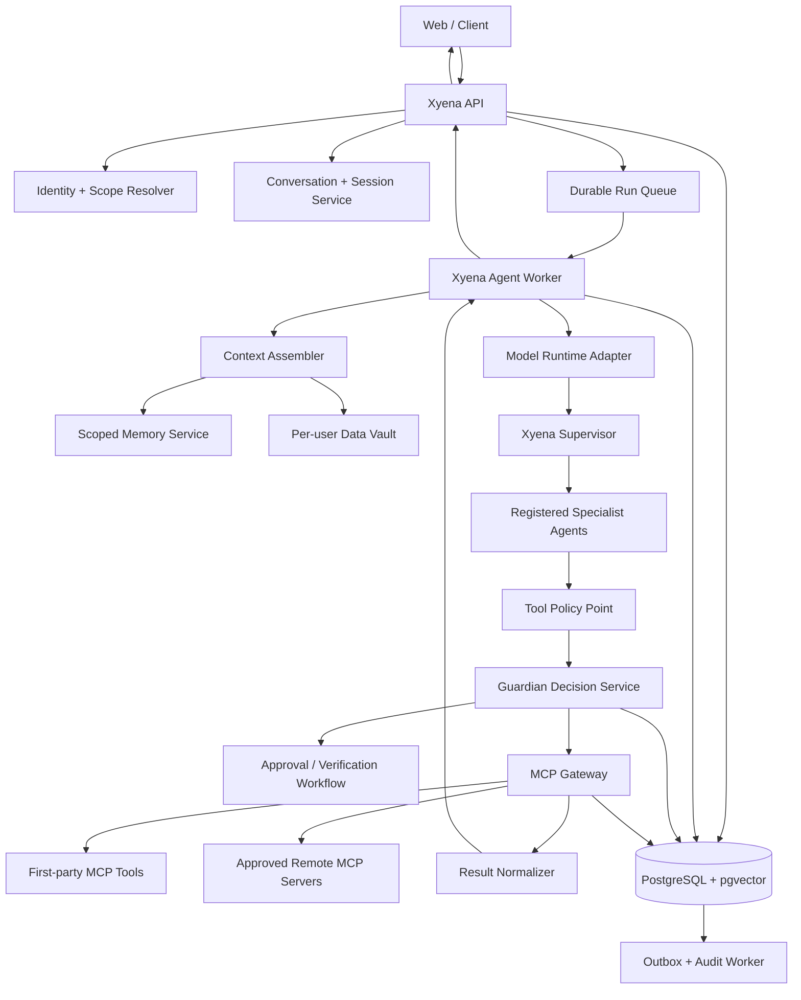
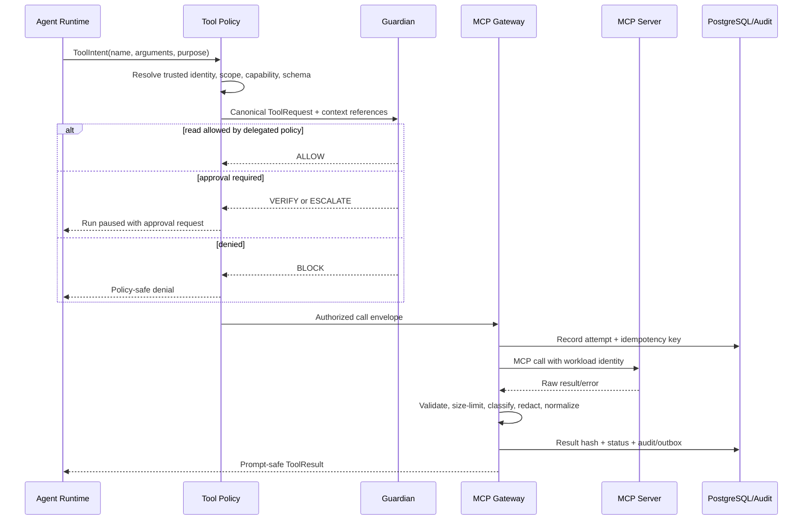

# Xyena + Guardian Core Backend Architecture

**Status:** implementation plan  
**Backend standard:** Python 3.12+, FastAPI, PostgreSQL, OpenAPI 3.1  
**Scope:** Xyena core platform, multi-agent runtime, context and memory, MCP tool calling, Guardian governance, audit, and operations  
**Explicitly excluded:** GST, banking, lending, payment, portfolio, DeFi, and other demo/domain applications; real financial execution; testing any demo application

## 1. Executive decision

Xyena is the main agent platform. Guardian is its independent authorization and safety boundary. The browser or mobile application must never call an MCP server, a model provider, or a sensitive external system directly.

The production call path is:

```text
Web or client application
        -> Xyena API
        -> Xyena Agent Runtime
        -> Tool Policy + Guardian
        -> MCP Gateway / MCP server
        -> approved internal or external capability
        -> normalized result + audit
        -> agent runtime
        -> streamed response to client
```

The backend will host the following:

- user, organization, tenant, role, consent, and session resolution;
- the Xyena supervisor and specialist-agent runtime;
- model-provider calls through the OpenAI Responses API / OpenAI Agents SDK adapter;
- first-party MCP servers and MCP clients for approved remote servers;
- tool discovery, schema validation, allowlists, approvals, retries, and result normalization;
- per-user and per-organization context and memory;
- Guardian policy evaluation, approval workflows, and authorization issuance;
- PostgreSQL persistence, tenant isolation, audit, and event delivery.

Remote MCP servers do not have to run inside the Xyena deployment. Xyena's MCP Gateway is hosted in the backend and may connect server-to-server to first-party or approved remote MCP servers. A publicly reachable server may also be supplied to the OpenAI Responses API as a hosted MCP tool, but only for capabilities whose risk policy allows that execution path. Sensitive or mutating tools remain Xyena-mediated so Guardian can enforce the final arguments and resource selection.

## 2. Current repository state and implementation truth

At the time this document was written:

- `apps/web` contains the React experience and architecture mockup;
- `apps/api` and `apps/mcp-server` exist as empty planned directories;
- `packages/agents`, `packages/context`, `packages/contracts`, `packages/memory`, and `packages/tools` exist as empty planned directories;
- the existing Markdown files describe the agents and Guardian concept;
- no Python backend, database schema, MCP server, Guardian service, agent runtime, or core backend test suite has been implemented yet.

**Implemented in this architecture task:** this reviewed backend plan only. No demo application was opened, executed, modified, or tested. Later phase completion reports must list actual migrations, services, endpoints, contracts, and tests that were completed; they must not report a phase as implemented merely because it appears in this document.

## 3. Architecture principles

1. **Guardian is enforcement, not advice.** A prompt-level guardrail is useful but cannot authorize a tool call.
2. **The model never supplies trusted identity or scope.** The authenticated backend injects tenant, organization, user, session, and case scope.
3. **MCP is a protocol, not a permission system.** The Xyena registry, tool policy, Guardian, and the target MCP server all enforce authorization.
4. **Memory is not authority.** Memory may help reasoning but cannot grant consent, create a mandate, approve a resource, or change policy.
5. **Session history is not long-term memory.** Conversation messages, working state, durable user facts, organization facts, and evidence are stored and retrieved differently.
6. **Deny by default.** An agent sees only the tools allowed for its version, tenant, user, purpose, and current run.
7. **Structured boundaries.** Agent outputs, tool inputs, tool results, decisions, and events use versioned Pydantic/JSON Schema contracts.
8. **Untrusted data stays data.** User content and tool output cannot rewrite system instructions, policies, tool definitions, or trusted context.
9. **Every side effect is idempotent and auditable.** Unknown outcomes are reconciled; they are not blindly retried.
10. **Tenant and user isolation is enforced in PostgreSQL and application code.** Filtering only in prompts is prohibited.
11. **Provider portability.** The domain runtime depends on an internal `ModelRuntime` interface, not directly on one provider SDK throughout the codebase.
12. **Start as a modular platform, preserve service boundaries.** Deploy independently where security or scaling requires it without prematurely creating many microservices.

## 4. Technology baseline

| Concern | Standard |
|---|---|
| Language | Python 3.12+ with strict type checking |
| Public/internal HTTP | FastAPI + Uvicorn |
| HTTP contract | OpenAPI 3.1 feature set; generated document uses `openapi: 3.1.0` for broad FastAPI/tooling compatibility and is validated against current 3.1.x clarifications |
| Validation/contracts | Pydantic v2 + generated JSON Schema |
| ORM and SQL | SQLAlchemy 2 async + psycopg 3 |
| Migrations | Alembic; forward-only production migrations |
| Primary database | PostgreSQL 16+ |
| Vector retrieval | `pgvector`, always combined with scope filters |
| Cache/ephemeral coordination | Redis, optional in Phase 1 and required only when more than one worker needs it |
| Model runtime | Internal adapter over OpenAI Agents SDK / Responses API |
| MCP | Official MCP Python SDK; Streamable HTTP for deployed servers |
| Background work | PostgreSQL-backed durable job/outbox worker initially; keep a workflow interface for later Temporal adoption |
| Object storage | S3-compatible encrypted storage for large/raw artifacts; PostgreSQL stores metadata and hashes |
| Authentication | External OIDC/OAuth 2.1 identity provider; short-lived JWTs; workload identity for services |
| Secrets | Cloud secret manager/KMS; database stores only secret references |
| Observability | OpenTelemetry traces, metrics, structured logs, correlation IDs |
| Tests | Pytest, pytest-asyncio, contract tests, PostgreSQL integration tests, security/isolation tests |
| Packaging | `uv`, workspace `pyproject.toml`, locked dependencies |

Pin exact dependency versions in the lock file, not in this architecture document. MCP SDK and Agents SDK compatibility must be verified during implementation because protocol and SDK versions evolve independently.

### 4.1 Contract-first OpenAPI rule

All Xyena REST services are OpenAPI-compatible. Pydantic models in `packages/contracts` are the canonical payload definitions; FastAPI generates the service descriptions and CI saves reviewed, bundled artifacts under `openapi/`.

```text
openapi/
  xyena-public-v1.yaml
  guardian-internal-v1.yaml
  mcp-control-internal-v1.yaml
  webhooks-v1.yaml
```

Required conventions:

- public REST base path is `/api/v1`;
- stable, unique `operationId` values are never generated from Python function names accidentally;
- API version (`info.version`) is independent of the OpenAPI document version;
- JSON bodies follow the OpenAPI 3.1 / JSON Schema 2020-12 model;
- reusable security schemes, errors, pagination, identifiers, timestamps, money, event envelopes, and headers live in `components`;
- errors use a documented `application/problem+json` schema with stable Xyena error codes;
- writes declare idempotency and optimistic-concurrency behavior (`Idempotency-Key`, `ETag`, `If-Match`) where applicable;
- `X-Correlation-ID` is accepted/generated and returned on every request;
- SSE endpoints document event names, event schemas, cursor behavior, and `Last-Event-ID` even though OpenAPI alone does not fully describe a streaming protocol;
- sensitive examples use masked/synthetic data only;
- CI lints and validates the bundled specification, detects breaking changes, and regenerates the TypeScript web client;
- production Swagger/ReDoc access is authenticated or disabled, while `/openapi.json` exposure follows environment policy.

OpenAPI describes Xyena REST control/data APIs. MCP remains a separate protocol endpoint. Xyena may reuse the same Pydantic/JSON Schemas for REST and MCP tool inputs/outputs, but it must never automatically expose every REST operation as a model tool. An explicit reviewed mapping connects an OpenAPI `operationId` or internal service method to an MCP `tool_version`.

See [OpenAPI and MCP contracts](./OPENAPI_AND_MCP_CONTRACTS.md) for the detailed compatibility and generation rules.

## 5. Deployable apps and internal packages

### 5.1 Deployable applications

| App | Responsibility | Exposure |
|---|---|---|
| `apps/api` | Public Xyena REST/SSE API, authentication, sessions, conversation endpoints, run submission, approval UI endpoints | Public behind API gateway |
| `apps/worker` | Durable agent runs, context assembly, model turns, tool loop, compaction, memory jobs, outbox delivery | Private |
| `apps/mcp-server` | First-party MCP tool server, approved remote-MCP client pool, tool registry synchronization, result normalization | Private by default; controlled `/mcp` exposure when required |
| `apps/guardian` | Independent policy decision point, approval workflow, authorization issuer, authorization verifier | Private and fail-closed |
| `apps/web` | Existing user and operations experience; consumes only `apps/api` | Public |

During Phases 1-2, `apps/worker` may run from the same image as `apps/api`, and Guardian may begin as a separately testable package. By Phase 3, Guardian must have an independently deployable process and database role. `apps/mcp-server` must never share external connector credentials with the browser or model prompt.

### 5.2 Python packages

```text
packages/
  contracts/       Pydantic DTOs, enums, JSON Schema, event contracts
  identity/        Authenticated principal, tenant scope, RBAC/ABAC helpers
  context/         Context assembler, token budgeter, context snapshots
  memory/          Session store, durable memory, retrieval and write policy
  agents/          Agent definitions, versioning, supervisor, provider adapter
  tools/           Tool registry, classification, filters, call pipeline
  guardian/        Deterministic policy, risk signals, decisions, authorization
  mcp_gateway/     MCP clients, server composition, transport/auth adapters
  persistence/     SQLAlchemy models, repositories, unit of work, RLS helpers
  audit/           Append-only event and outbox APIs
  observability/   Logging, tracing, metrics, redaction
```

Packages must not import from `apps/*`. Apps compose packages through dependency injection.

## 6. Logical architecture



## 7. Multi-agent runtime

### 7.1 Agent model

The existing agent roles remain registered capabilities, not separately trusted identities by default:

- Intake Agent;
- Business Agent;
- Invoice Agent;
- Delivery Agent;
- Payment Agent;
- Fraud/Risk Agent;
- Credit Agent;
- Decision Orchestrator;
- Funding Agent;
- Guardian Agent;
- Monitoring Agent.

This core implementation builds the runtime, registry, contracts, permissions, and Guardian boundary. It does not implement or test the GST/bank/finance behavior of these domain agents.

Each agent definition has:

- stable `agent_id` and immutable `agent_version_id`;
- name, purpose, owner, status, model policy, instructions reference, and output schema;
- explicit allowed tool capabilities and maximum sensitivity;
- allowed handoffs / agent-as-tool relationships;
- context profile and memory retrieval policy;
- token, time, turn, and tool-call budgets;
- input/output guardrails;
- rollout status and evaluation baseline.

### 7.2 Orchestration choice

Use **manager-style orchestration** for Xyena:

- the Xyena Supervisor owns the user turn and invokes specialists as tools/jobs;
- specialists return structured findings and cannot take over the public session;
- handoffs are used only when the product intentionally transfers conversation ownership;
- Guardian is not a handoff target and cannot be outvoted by specialists;
- deterministic workflow state lives in PostgreSQL, not only inside an agent transcript.

The OpenAI Agents SDK may implement the runner, structured outputs, tool loop, tracing, and session protocol. The Xyena `ModelRuntime` adapter must still own persistence, scope, policy callbacks, and tool mediation. Using the SDK must not allow direct tools around the Xyena call pipeline.

### 7.3 Run state machine

```text
QUEUED
  -> ASSEMBLING_CONTEXT
  -> RUNNING_MODEL
  -> TOOL_REQUESTED
  -> POLICY_CHECK
  -> WAITING_APPROVAL | CALLING_TOOL | BLOCKED
  -> TOOL_RESULT_RECORDED
  -> RUNNING_MODEL
  -> COMPLETED | FAILED | CANCELLED | EXPIRED
```

State transitions use compare-and-set version numbers. Only one worker owns a run lease. Every transition emits an outbox event in the same database transaction.

## 8. Context and memory architecture

### 8.1 Four different concepts

| Layer | Lifetime | Contents | Sent to model? | Authority? |
|---|---|---|---|---|
| Trusted runtime context | One run | IDs, roles, policy handles, database/services, approval state | No | Yes, for backend enforcement |
| Model context snapshot | One model turn | selected messages, summaries, approved memories, safe tool results | Yes | No |
| Session memory | Conversation lifetime | ordered user/assistant/tool items and summaries | Selected subset | No |
| Durable memory | Cross-session | approved user preferences, organization facts, case facts, learned summaries | Retrieved subset | No |

The OpenAI Agents SDK explicitly distinguishes local application context from LLM-visible context. Xyena will represent local context as a Pydantic model passed through the run, while building a separate immutable `ContextSnapshot` for each model turn.

### 8.2 Runtime context

```python
class RuntimeContext(BaseModel):
    tenant_id: UUID
    organization_id: UUID
    user_id: UUID
    session_id: UUID
    conversation_id: UUID
    run_id: UUID
    case_id: UUID | None = None
    correlation_id: UUID
    roles: tuple[str, ...]
    consent_ids: tuple[UUID, ...]
    policy_bundle_version: str
    locale: str
    timezone: str
```

Repositories, loggers, secret clients, and network clients are injected as Python dependencies; they are not serialized into this model or prompts.

### 8.3 Session memory

Xyena uses **application-managed session history in PostgreSQL** as the primary record. Implement the Agents SDK `Session` protocol over SQLAlchemy, keyed by Xyena's opaque `session_id`. Do not use an email, phone number, account number, or other PII as the session key.

Rules:

- one user may have many sessions and conversations;
- a shared organization conversation needs explicit membership records;
- messages and tool items are append-only; corrections create superseding records;
- full history is not blindly sent on each turn;
- a context budgeter selects recent turns, pinned items, open tool/approval state, and a signed summary;
- summaries retain source item ranges and the model/prompt version that produced them;
- sessions have inactivity expiry and explicit deletion/retention policy;
- `conversation_id` / `previous_response_id` from a model provider may be recorded for optimization, but they do not replace Xyena's record and must not be mixed with SDK session continuation in the same run.

### 8.4 Durable memory types

| Memory type | Example | Scope | Write policy |
|---|---|---|---|
| User preference | response language, display preference | tenant + user | user statement or confirmed inference |
| User profile fact | role, approved operating preference | tenant + user | verified source or user confirmation |
| Organization memory | operating rule, approved terminology | tenant + organization | privileged writer + provenance |
| Case memory | facts and progress for one work item | tenant + organization + case | workflow event or verified source |
| Agent procedural memory | non-user-specific operational lesson | agent version | curated/evaluated deployment process |
| Session summary | compressed prior turns | tenant + user + session | generated, versioned, reversible |

Memory records include provenance, confidence, sensitivity, retention, consent, validity interval, conflict state, and supersession. A model-proposed memory write enters `PENDING_REVIEW` unless the memory policy explicitly permits that category.

### 8.5 Retrieval pipeline

```text
Authenticated scope
  -> SQL/RLS scope filter
  -> memory type + consent + sensitivity policy
  -> validity / conflict / deletion filter
  -> lexical + vector candidate search
  -> relevance rerank
  -> token and item budget
  -> prompt-safe projection
  -> immutable ContextSnapshot with source references
```

Vector similarity is never allowed to run across all tenants and filter afterward. Scope predicates must be part of the database query before ranking.

### 8.6 Per-user and financial data

Per-user financial or otherwise highly sensitive data is stored in a **data vault plane**, separate from ordinary chat memory:

- raw files/payloads: encrypted object storage, tenant/user prefixes, malware/content classification, immutable hash;
- metadata and normalized records: PostgreSQL `data` schema;
- secrets/tokens: secret manager only; PostgreSQL stores a `secret_ref`;
- prompt access: only minimum fields selected by a data-access policy;
- access: explicit purpose, consent, field-level projection, and audit event;
- retention/deletion: policy-driven with legal-hold support;
- memory: sensitive financial facts are not automatically copied into durable conversational memory.

Core tables can represent user financial data without implementing a bank or GST application. Examples include connections, consents, account metadata, balances/transactions as source snapshots, documents, and access logs. Domain-specific adapters are later plugins behind MCP and are out of scope for this core build.

## 9. MCP and tool-calling architecture

### 9.1 Hosting answer

`apps/mcp-server` is a Python ASGI service. The official MCP Python SDK's Streamable HTTP application is mounted in FastAPI at `/mcp`. It exposes first-party Xyena tools and also contains a controlled MCP client layer for remote servers.

- Deployed MCP: Streamable HTTP.
- Local development and isolated tests: in-process transport or stdio where appropriate.
- New production integrations: do not use legacy SSE.
- Browser clients: do not receive MCP credentials and do not call `/mcp` directly.
- Health/OAuth callbacks: regular FastAPI routes with their own explicit authentication rules.

### 9.2 Two MCP execution modes

| Mode | Call owner | Use | Guardian requirement |
|---|---|---|---|
| Xyena-mediated MCP | `apps/mcp-server` opens the MCP client connection | private servers, sensitive reads, mutations, full telemetry | Xyena policy/Guardian before call; target server rechecks |
| Hosted MCP | OpenAI Responses API connects to a public remote MCP server | low-risk approved capabilities where the hosted round trip is acceptable | OpenAI approval configuration plus Xyena pre-policy; prohibited for protected execution until equivalent enforcement is proven |

Default to Xyena-mediated MCP for the first production release. Hosted MCP can be enabled per `tool_version` with a security review.

### 9.3 MCP server registry

Each server registration contains:

- owner tenant or `platform` ownership;
- stable label, description, environment, status, and trust tier;
- transport (`streamable_http`, `stdio_dev`, `hosted_mcp`);
- URL or command reference, never embedded credentials;
- authentication method and `secret_ref`;
- allowed egress hostnames, TLS/mTLS settings, timeouts, retries, and circuit breaker;
- tool-list cache TTL and last discovery hash;
- protocol/SDK compatibility metadata;
- data residency and retention classification;
- health, security review, and last successful call timestamps.

### 9.4 Tool registry

The MCP tool list is discovery input, not trusted policy. Xyena creates an immutable `tool_version` for each schema hash and assigns:

- canonical Xyena tool name and original server tool name;
- description and JSON input/output schema;
- risk class: `READ`, `SENSITIVE_READ`, `MUTATE`, `PRIVILEGED`;
- side-effect and idempotency behavior;
- data classifications read/returned;
- required roles, consents, purposes, approvals, and Guardian policy;
- timeout, maximum result size, and redaction policy;
- whether parallel execution is allowed;
- whether hosted MCP is allowed;
- enabled agents and tenants.

Tool name collisions are resolved with stable server-qualified names. Any discovered schema change disables the prior approval until reviewed or explicitly accepted.

### 9.5 Call pipeline



### 9.6 Call safety rules

- Validate model-generated arguments against the reviewed schema and application policy.
- Inject trusted scope server-side; reject any model-supplied scope identifiers that conflict.
- Resolve resource ownership before the network call.
- Never put OAuth tokens in URLs, prompts, tool arguments, or ordinary logs.
- Use idempotency keys for all mutations and retain lookup status for unknown outcomes.
- Bound connection, request, and total run timeouts.
- Retry reads only when policy and error class permit; do not retry mutations without idempotency proof.
- Cap tool output size and store large results as scoped artifacts with a small prompt-safe projection.
- Treat all returned strings as untrusted content.
- Record request/response hashes, not unrestricted sensitive payloads, in audit logs.
- Emit OpenTelemetry trace context across API, worker, Guardian, gateway, and MCP server.

## 10. Guardian architecture

### 10.1 Responsibility

Guardian is a policy decision point and authorization issuer. It evaluates observable actions and trusted metadata, not private model reasoning. It has no direct external connector credentials.

Guardian evaluates:

- workload, agent, tenant, organization, user, and session identity;
- agent version, status, role, capability, and mandate;
- user purpose, consent, resource ownership, and current session state;
- tool/server trust tier and tool schema version;
- argument risk, destination/resource selection, and data classification;
- evidence/context source integrity;
- behavior, rate, sequence, and action-graph signals;
- applicable platform, tenant, and domain policy versions;
- prior approval, denial, and authorization-consumption state.

### 10.2 Decisions

| Decision | Runtime behavior |
|---|---|
| `ALLOW` | exact canonical call may continue |
| `CONSTRAIN` | Guardian returns an allowed argument patch/limits; call must be recanonicalized and rehashed |
| `VERIFY` | pause and request additional user/system verification |
| `ESCALATE` | pause for an authorized human reviewer |
| `BLOCK` | stop and record reason codes |

### 10.3 Deterministic before probabilistic

Evaluate in this order:

1. identity/scope invariants;
2. tool enablement and schema validation;
3. consent, role, ownership, and mandate rules;
4. static amount/rate/destination/data policies;
5. behavior and graph risk signals;
6. optional model-assisted risk explanation;
7. final deterministic decision table.

An LLM may summarize signals or recommend a review, but it cannot produce the cryptographic authorization or override a deterministic denial.

### 10.4 Execution authorization

For protected calls, `ALLOW` or `CONSTRAIN` creates a short-lived, single-use authorization bound to:

- Guardian decision and policy version;
- canonical tool request hash;
- tool and server version;
- tenant, organization, user, session, run, agent, and resource scope;
- exact normalized arguments and purpose;
- issue/expiry timestamps, nonce, key ID, and signature;
- maximum number of uses (normally one).

The MCP Gateway consumes the authorization atomically before protected execution. The target first-party MCP tool independently validates the signature, audience, expiry, scope, tool version, and request hash. Guardian unavailable, audit unavailable, or consumption state unavailable means protected calls fail closed.

### 10.5 Human approval

Approval records are not chat messages. They have a state machine:

```text
PENDING -> APPROVED | REJECTED | EXPIRED | CANCELLED
```

The reviewer sees a safe diff of purpose, tool, affected resource, relevant arguments, Guardian reason codes, and data exposure. Approval is bound to the request hash; argument changes create a new request. The paused agent run resumes from a persisted run checkpoint.

## 11. PostgreSQL data architecture

### 11.1 Schema namespaces

```text
iam           tenants, organizations, users, memberships, roles, consent
conversation  sessions, conversations, members, messages, summaries
agent         definitions, versions, permissions, runs, run steps, artifacts
context       snapshots and snapshot items
memory        items, embeddings, conflicts, access and write reviews
data          connections, confidential artifacts, normalized sensitive records
mcp           servers, tools, versions, policies, calls, attempts, results
guardian      policy bundles, mandates, evaluations, decisions, approvals, authorizations
audit         append-only events, outbox, data-access log
ops           durable jobs, leases, idempotency records, circuit state
```

All mutable tables include `created_at`, `updated_at`, and optimistic `version`. Security-critical records are append-only or superseded instead of updated in place. UUIDv7 is recommended for sortable public-safe identifiers.

### 11.2 Identity and scope models

| Table | Important columns | Invariant |
|---|---|---|
| `iam.tenants` | `id`, `slug`, `status`, `data_region`, `policy_bundle_id` | top isolation boundary |
| `iam.organizations` | `id`, `tenant_id`, `parent_id`, `type`, `status` | unique within tenant |
| `iam.users` | `id`, `tenant_id`, `idp_subject_hash`, `status`, `locale`, `timezone` | no raw IdP token |
| `iam.memberships` | `tenant_id`, `organization_id`, `user_id`, `status` | proves organization access |
| `iam.roles` | `id`, `tenant_id`, `name`, `permissions` | versioned permission set |
| `iam.role_bindings` | principal/scope/role IDs, validity interval | evaluated server-side |
| `iam.consents` | user/org, purpose, data classes, valid interval, status, proof ref | consent is purpose-bound |
| `iam.service_identities` | workload name, audience, key/cert ref, status | agents/services authenticate independently |

### 11.3 Conversation and session models

| Table | Important columns | Invariant |
|---|---|---|
| `conversation.sessions` | `id`, scope IDs, status, last_seen_at, expires_at, metadata | opaque ID; one owning user |
| `conversation.conversations` | `id`, session/user/org IDs, title, status, model_policy_id | tenant scoped |
| `conversation.members` | conversation, user, role, joined/left times | required for shared conversations |
| `conversation.messages` | conversation, sequence, role, content ref/JSON, sensitivity, supersedes_id | append-only ordered items |
| `conversation.tool_items` | message/run/call linkage, item type, safe projection | tool history links to canonical call |
| `conversation.summaries` | source sequence range, summary, model/prompt version, hash | never hides unresolved approvals |
| `conversation.provider_state` | provider, conversation/response IDs, encrypted metadata | optimization, not system of record |

### 11.4 Agent and run models

| Table | Important columns | Invariant |
|---|---|---|
| `agent.definitions` | stable name, purpose, owner, status | logical agent |
| `agent.versions` | definition, version, instructions ref/hash, output schema, model policy | immutable once active |
| `agent.tool_grants` | agent version, tool version/capability, constraints | deny by default |
| `agent.handoff_grants` | source version, target version, input schema | explicit graph |
| `agent.runs` | IDs/scope, state, start agent, budgets, lease/version, result/error | durable state machine |
| `agent.run_steps` | run, sequence, type, agent version, status, input/output refs | full observable timeline |
| `agent.findings` | run, agent version, schema version, JSON, source refs, status | schema-valid structured output |
| `agent.artifacts` | run, type, object ref, hash, sensitivity | large output outside transcript |

### 11.5 Context and memory models

| Table | Important columns | Invariant |
|---|---|---|
| `context.snapshots` | run/turn, scope, token budget, policy version, hash | immutable model input manifest |
| `context.snapshot_items` | snapshot, source type/id, projection, token count, trust/sensitivity | every item traceable |
| `memory.items` | scope IDs, type, content, provenance, confidence, sensitivity, valid interval, status | no unsourced durable fact |
| `memory.embeddings` | memory ID, model/version, vector, content hash | regenerated on content/model change |
| `memory.conflicts` | two memory IDs, type, resolution/status | contradictions stay visible |
| `memory.write_reviews` | proposed item, policy result, reviewer, state | controls model-proposed writes |
| `memory.access_events` | run/snapshot, memory ID, reason, result | retrieval audit |

### 11.6 Per-user sensitive and financial data models

| Table | Important columns | Invariant |
|---|---|---|
| `data.connections` | scope, provider type, status, secret ref, consent ID, sync cursor | no plaintext credentials |
| `data.artifacts` | owner scope, object ref, media type, hash, classification, retention | encrypted and immutable raw version |
| `data.source_snapshots` | connection, source type/id hash, fetched_at, schema version, payload object ref | preserves source/version |
| `data.financial_accounts` | user/org, source snapshot, external ID hash, type, currency, masked label, status | metadata only; encrypted sensitive fields |
| `data.financial_transactions` | account, source snapshot, external ID hash, occurred_at, amount, currency, direction, category, counterparty token | tenant partition + provenance |
| `data.financial_documents` | artifact, owner, document type, period, extraction status | content stays out of ordinary memory |
| `data.record_projections` | source snapshot, schema name/version, safe normalized JSON, hash | only reviewed schemas enter agent context |
| `audit.data_access_events` | principal/run, record/artifact, fields, purpose, consent, decision | mandatory for every sensitive read |

Financial tables are data containers for Xyena core. They do not imply implementation of any bank/GST connector or financial demo.

### 11.7 MCP models

| Table | Important columns | Invariant |
|---|---|---|
| `mcp.servers` | owner scope, label, transport, endpoint, auth type, secret ref, trust/status | reviewed endpoint allowlist |
| `mcp.server_versions` | server, protocol/implementation versions, discovery hash, discovered_at | immutable discovery snapshot |
| `mcp.tools` | server, canonical/original names, status | stable logical tool |
| `mcp.tool_versions` | tool, schema hashes/JSON, risk class, side-effect flags, hosted policy | schema change creates version |
| `mcp.tool_policies` | tool version, roles, purposes, consent/data rules, approval mode, limits | evaluated outside prompt |
| `mcp.tool_calls` | call/run/step, scope, tool version, canonical args/hash, purpose, state, idempotency key | canonical source of truth |
| `mcp.call_attempts` | call, attempt number, endpoint version, times, status/error class | retries observable |
| `mcp.tool_results` | call, status, safe projection, raw object ref, hashes, classification | raw output restricted |
| `mcp.health_events` | server, state, latency/error signal, circuit transition | drives trust/circuit policy |

### 11.8 Guardian models

| Table | Important columns | Invariant |
|---|---|---|
| `guardian.policy_bundles` | tenant/platform, version, status, rules hash/ref | immutable active version |
| `guardian.mandates` | subject, capability, scope, constraints, valid interval, status | explicit authority |
| `guardian.evaluations` | request hash, identities/scope, policy version, signal snapshot | immutable input |
| `guardian.decisions` | evaluation, verdict, reason codes, constraints, risk tier | explainable result |
| `guardian.approval_requests` | decision/call, request hash, reviewer role, state, expiry | hash-bound workflow |
| `guardian.approval_actions` | request, reviewer, action, reason, timestamp | append-only |
| `guardian.authorizations` | decision, request hash, scope, audience, expiry, nonce hash, key ID, status | short-lived/single-use |
| `guardian.authorization_uses` | authorization, call, consumed_at, result | unique authorization consumption |
| `guardian.risk_signals` | subject/resource/action, type, score, source ref, valid interval | signals do not self-authorize |

### 11.9 Operations and audit models

| Table | Important columns | Invariant |
|---|---|---|
| `ops.jobs` | type, payload ref, state, available_at, attempts, lease owner/expiry | durable worker queue |
| `ops.idempotency_keys` | scope, operation, key, request hash, result ref, status | unique per scoped operation |
| `ops.circuit_breakers` | dependency, state, counters, opened_until | shared dependency posture |
| `audit.events` | sequence/id, scope, actor, event type, subject, safe payload, previous/event hash | append-only/tamper evident |
| `audit.outbox` | aggregate, event type, payload, publish state | same transaction as state change |

### 11.10 Isolation controls

- Put `tenant_id` on every tenant-owned table even when derivable through a join.
- Use PostgreSQL Row-Level Security for all tenant-owned tables.
- Set transaction-local `app.tenant_id`, `app.user_id`, and service role from verified authentication.
- Give API, worker, MCP, and Guardian different database roles.
- Guardian can read the policy/audit facts it needs but cannot read unrestricted raw user artifacts.
- MCP cannot mint Guardian decisions; Guardian cannot read connector secrets.
- Foreign keys include tenant scope where practical to prevent cross-tenant references.
- Partition high-volume tables (`messages`, `tool_calls`, `transactions`, `audit.events`) by time and/or tenant strategy after measurement.
- Backups, replicas, analytics exports, and vector indexes preserve the same data-region and isolation rules.

## 12. Core contracts

```python
class ToolIntent(BaseModel):
    requested_name: str
    arguments: dict[str, Any]
    purpose: str
    resource_refs: list[str] = []


class CanonicalToolRequest(BaseModel):
    call_id: UUID
    run_id: UUID
    agent_version_id: UUID
    scope: RuntimeContext
    tool_version_id: UUID
    normalized_arguments: dict[str, Any]
    purpose: str
    idempotency_key: str | None
    request_hash: str


class GuardianDecision(BaseModel):
    decision_id: UUID
    verdict: Literal["ALLOW", "CONSTRAIN", "VERIFY", "BLOCK", "ESCALATE"]
    reason_codes: list[str]
    constrained_arguments: dict[str, Any] | None = None
    policy_bundle_version: str
    expires_at: datetime | None = None


class SafeToolResult(BaseModel):
    call_id: UUID
    status: Literal["SUCCEEDED", "FAILED", "UNKNOWN"]
    model_projection: dict[str, Any] | str | None
    result_ref: UUID | None
    provenance_hash: str
    security_flags: list[str]
```

Canonical JSON uses stable key ordering, normalized decimal/date/UUID representations, and a versioned canonicalization algorithm before hashing.

## 13. Public and internal API surface

### Public Xyena API

```text
POST   /api/v1/sessions
GET    /api/v1/sessions/{session_id}
DELETE /api/v1/sessions/{session_id}
POST   /api/v1/conversations
GET    /api/v1/conversations/{conversation_id}
GET    /api/v1/conversations/{conversation_id}/messages
POST   /api/v1/conversations/{conversation_id}/messages
GET    /api/v1/runs/{run_id}
POST   /api/v1/runs/{run_id}/cancel
GET    /api/v1/runs/{run_id}/events          # SSE stream
GET    /api/v1/approvals
GET    /api/v1/approvals/{approval_id}
POST   /api/v1/approvals/{approval_id}/approve
POST   /api/v1/approvals/{approval_id}/reject
GET    /api/v1/me/memories
DELETE /api/v1/me/memories/{memory_id}
GET    /api/v1/me/data-connections
DELETE /api/v1/me/data-connections/{connection_id}
```

### Internal APIs

```text
POST /internal/guardian/evaluate
POST /internal/guardian/authorizations/{id}/consume
POST /internal/mcp/calls
GET  /internal/mcp/calls/{id}
POST /internal/runs/{id}/resume
GET  /health/live
GET  /health/ready
```

The actual MCP endpoint is `/mcp`, not a REST wrapper. The internal REST call endpoint is for Xyena's durable orchestration and must invoke the same registry/policy pipeline as MCP-originated calls.

## 14. Failure behavior

| Failure | Required behavior |
|---|---|
| Tenant/user scope unavailable | reject before context retrieval |
| Session store unavailable | do not invent history; retry or fail clearly |
| Model provider timeout | persist resumable failure; no silent duplicate run |
| Invalid structured agent output | reject, bounded retry, then fail/escalate |
| MCP discovery/schema changed | disable affected tool version pending policy review |
| MCP server unavailable | bounded retry/circuit breaker; never fabricate result |
| Sensitive output fails validation | quarantine raw result; return safe error |
| Guardian unavailable | fail closed for sensitive/mutating/privileged calls |
| Approval expires | mark expired and resume with non-success result |
| Authorization changed/expired/used | reject execution |
| Mutation result unknown | reconcile by idempotency lookup; do not blind retry |
| Audit/outbox persistence fails | rollback protected state change |
| Memory vector search fails | deterministic scoped lookup or no memory, never cross-scope fallback |
| Context too large | summarize/compact with traceable source ranges; never drop approval/policy state |

## 15. Security and privacy baseline

- OIDC login, MFA for reviewers, and short-lived service tokens.
- RBAC plus resource/purpose/consent ABAC.
- PostgreSQL RLS and scoped repository methods.
- Secret manager and KMS-backed encryption; envelope encryption for especially sensitive fields.
- TLS everywhere, optional mTLS between Guardian/MCP and first-party tools.
- SSRF defense: reviewed MCP endpoints, DNS/IP controls, redirects policy, egress proxy, private-range rules.
- Strict request/response schema, payload limits, MIME checks, malware scanning, and object-store quarantine.
- Prompt injection controls: source labels, instruction/data separation, safe projections, no raw connector text in system prompts.
- Log redaction, field allowlists, hash references, and no model/tool secrets in traces.
- Key rotation for Guardian signing keys with `kid` and overlapping verification windows.
- Dependency/SBOM scanning and signed deploy artifacts.
- Retention, export, deletion, and legal hold workflows per data class.
- Security review required before enabling hosted MCP, new remote servers, new tool schema versions, or new privileged tools.

## 16. Observability and SLO guidance

Every request carries `trace_id`, `correlation_id`, `tenant_id`, `session_id`, `run_id`, and when applicable `tool_call_id` and `guardian_decision_id`. Logs contain opaque IDs, not sensitive values.

Initial service indicators:

- API request latency and error rate;
- run queue delay, model turn latency, token usage, and completion rate;
- context item/token counts and compaction frequency;
- memory retrieval hit rate and rejected cross-scope attempts;
- MCP discovery/call latency, schema drift, error class, retry, and circuit state;
- Guardian decision latency and verdict distribution;
- approval age/expiry and reviewer action time;
- authorization rejection/duplicate-consumption attempts;
- outbox lag and audit persistence failures.

Set numerical SLOs after a measured Phase 2 load baseline. Protected operations prioritize correctness and auditability over low latency.

## 17. Five implementation phases

### Phase 1 — Core foundation, identity, PostgreSQL, and contracts

**Goal:** create a secure Python platform skeleton with real scope isolation and durable conversations.

Deliver:

- root Python workspace, `pyproject.toml`, `uv.lock`, lint/type/test configuration;
- `apps/api` FastAPI app and `apps/worker` process entry point;
- PostgreSQL, Alembic, async SQLAlchemy, unit-of-work pattern;
- `iam`, `conversation`, `agent`, `context`, `memory`, `audit`, and `ops` base migrations;
- OIDC principal adapter and trusted `RuntimeContext`;
- RLS policies and distinct application database roles;
- sessions, conversations, messages, SSE run events, and deletion endpoints;
- Pydantic core contracts and JSON Schema generation;
- reviewed OpenAPI 3.1 public/internal descriptions, stable operation IDs, standard errors/headers, validation, and a generated TypeScript client for `apps/web`;
- append-only audit and transactional outbox;
- a provider-neutral model interface with a no-tool core Xyena agent;
- PostgreSQL-backed Agents SDK session adapter or equivalent internal session interface.

Core tests only:

- tenant/user isolation and RLS;
- session ordering, expiry, sharing, deletion, and concurrent writes;
- contract/schema snapshots;
- outbox atomicity and run-state concurrency.

**Phase 1 ready:** Xyena Core API, database, worker skeleton, authenticated per-user conversations, and auditable no-tool agent runs.

### Phase 2 — MCP Gateway and controlled tool calling

**Goal:** support multiple first-party and approved remote MCP servers without bypassing Xyena policy.

Deliver:

- `apps/mcp-server` using the official MCP Python SDK mounted in FastAPI;
- Streamable HTTP `/mcp`, service authentication, host/origin/egress restrictions;
- `mcp` schema migrations for servers, tools, versions, policies, calls, attempts, results, and health;
- discovery synchronization, schema hashing/versioning, stable qualified names, and tool-list cache invalidation;
- explicit reviewed OpenAPI-operation/internal-handler-to-MCP-tool mappings; no automatic exposure of arbitrary REST routes;
- MCP client pool for Streamable HTTP and development-only stdio/in-process transports;
- canonical tool request pipeline, schema validation, agent allowlists, trusted scope injection;
- risk classification, idempotency, timeout/retry/circuit breaker, output size limits, safe result projection;
- agent runtime integration through one `ToolBroker`; no direct SDK tool escapes;
- two harmless core platform tools for verification, such as session metadata read and user preference read/write—no finance/GST/bank demo tools.

Core tests only:

- discovery and schema-drift behavior;
- allowed and denied agent/tool combinations;
- scope injection and forged-scope rejection;
- malformed/oversized/untrusted tool results;
- retry/idempotency/circuit behavior;
- multiple MCP servers with colliding tool names.

**Phase 2 ready:** MCP Gateway/Server, multiple controlled MCP connections, and Xyena agent tool calling for harmless core tools.

### Phase 3 — Guardian enforcement and approvals

**Goal:** make sensitive and mutating tool calls impossible without Guardian policy.

Deliver:

- `apps/guardian` as an independent internal FastAPI service and database role;
- `guardian` migrations for policies, mandates, evaluations, decisions, approvals, authorizations, uses, and risk signals;
- deterministic policy engine and versioned policy bundles;
- five Guardian verdicts and stable reason-code catalog;
- exact request canonicalization/hashing;
- `CONSTRAIN` recanonicalization and second validation;
- human approval endpoints, reviewer RBAC, expiry, and durable run pause/resume;
- signed, audience-bound, short-lived, single-use authorization;
- atomic authorization consumption in the MCP Gateway;
- fail-closed behavior and tamper-evident audit chain.

Core tests only:

- every verdict path;
- changed arguments after approval;
- expired, reused, wrong-audience, and invalid-signature authorizations;
- Guardian/audit outage behavior;
- approval race and replay attempts;
- prompt/tool output attempting to grant itself authority.

**Phase 3 ready:** Guardian service, approval console APIs, enforced sensitive/mutating tool boundary, and protected first-party core tool execution.

### Phase 4 — Full multi-agent context and memory platform

**Goal:** enable Xyena to coordinate multiple registered agents with safe per-user/session/durable memory.

Deliver:

- versioned agent definitions, grants, handoff graph, model policies, and structured finding contracts;
- Xyena Supervisor manager pattern and specialist-agent-as-tool execution;
- immutable context snapshots and token budgeter;
- session compaction/summaries with source ranges;
- durable memory types, provenance, conflicts, write review, retention, deletion, and retrieval audit;
- `pgvector` embeddings with scope-first retrieval;
- `data` vault migrations, encrypted artifact metadata, safe normalized projections, and data-access audit;
- user memory management endpoints and data-connection metadata endpoints;
- behavioral telemetry/action graph inputs for Guardian;
- model/provider evaluation fixtures for structured outputs and tool selection.

Use generic/core fixtures only. Do not connect, run, or test GST, bank, finance, or other demo applications.

**Phase 4 ready:** Xyena multi-agent runtime, per-user session memory, controlled durable memory, per-user confidential data plane, and Guardian-aware agent collaboration.

### Phase 5 — Production hardening and operational readiness

**Goal:** make the core platform deployable, observable, recoverable, and safely extensible.

Deliver:

- container images, infrastructure manifests, environment separation, migrations pipeline;
- managed PostgreSQL/pgvector, Redis where justified, object storage, KMS/secrets;
- autoscaling and separate resource limits for API, worker, MCP, and Guardian;
- OpenTelemetry dashboards, alerts, audit export, run/tool/decision operations views;
- backup/restore, disaster recovery, key rotation, deletion/retention jobs;
- load, soak, chaos, dependency-outage, and fail-closed tests for core services;
- security threat model, SSRF/egress test, penetration test, dependency/SBOM process;
- MCP server onboarding checklist and tool-version review workflow;
- agent/prompt/policy rollout, canary, rollback, and evaluation gates;
- incident runbooks and production readiness review.

**Phase 5 ready:** production Xyena Core API, Agent Worker, MCP Gateway/Server, Guardian Service, operations/reviewer functions, and the existing web app connected to these core APIs.

## 18. Final app readiness after all five phases

The following core applications should be ready:

1. **Xyena Core API** — authenticated user sessions, conversations, streaming runs, user memory/data controls, and approvals.
2. **Xyena Agent Worker** — durable supervisor/specialist runs, context assembly, model calls, and tool loops.
3. **Xyena MCP Gateway/Server** — first-party tools, multiple approved MCP server connections, schemas, policies, calls, and safe results.
4. **Guardian Service** — independent decisions, constraints, verification/escalation, approvals, and signed authorizations.
5. **Xyena Web integration** — the existing web application connected only to the Xyena Core API, with run/tool/approval/Guardian status.
6. **Operations and reviewer capabilities** — audit search, MCP/tool health, approval queues, policy/agent version visibility, and incident controls. This may begin inside the main web app rather than as another deployable app.

The following should **not** be declared ready as part of this plan:

- GST or e-invoice applications;
- bank, Account Aggregator, payment, ledger, lending, or funding applications;
- portfolio, wallet, DeFi, or other financial demo applications;
- any real financial execution connector;
- domain-agent accuracy claims that were not implemented and evaluated.

## 19. Definition of successful implementation

The core backend is successfully implemented only when all of the following are evidenced:

- migrations and RLS policies exist and pass isolation tests;
- the Xyena API creates authenticated per-user sessions and durable runs;
- context snapshots show exactly which scoped items the model received;
- session memory and durable memory are separate and user-manageable;
- multiple MCP servers/tools can be registered without name or schema ambiguity;
- no agent can call an ungranted tool or forge tenant/user/resource scope;
- sensitive/mutating calls cannot reach MCP execution without a valid Guardian decision/authorization;
- approvals are hash-bound, resumable, expiring, and replay-safe;
- secrets and raw sensitive data stay out of prompts, ordinary logs, and browser storage;
- every model turn, tool attempt/result, Guardian decision, approval, authorization use, memory read/write, and sensitive data access is auditable;
- dependency failures produce the documented fail-closed or safe-degradation behavior;
- only the core platform test suites have been run for this scope;
- the completion report links the implemented files/migrations and gives actual test results.

## 20. Recommended implementation order inside each phase

For every phase:

1. finalize Pydantic contract and threat assumptions;
2. create forward migration and RLS policy;
3. implement repository/service behavior;
4. expose internal then public API;
5. add structured audit/outbox event;
6. write isolation, authorization, failure, and concurrency tests;
7. add metrics/traces and runbooks;
8. demonstrate the phase exit criteria with harmless core fixtures;
9. document exactly what was implemented and what remains planned.

## 21. Source guidance

This plan aligns with the current primary guidance reviewed on 2026-08-28:

- [OpenAI Responses API: tools, MCP tools, custom function calls, parallel calls, conversation state](https://developers.openai.com/api/reference/resources/responses/methods/create)
- [OpenAI MCP and Connectors: remote MCP, allowlists, approvals, and authentication](https://developers.openai.com/api/docs/guides/tools-connectors-mcp/)
- [OpenAI Agents SDK: agent definitions and runtime](https://openai.github.io/openai-agents-python/agents/)
- [OpenAI Agents SDK: context management](https://openai.github.io/openai-agents-python/context/)
- [OpenAI Agents SDK: sessions](https://openai.github.io/openai-agents-python/sessions/)
- [OpenAI Agents SDK: MCP integrations](https://openai.github.io/openai-agents-python/mcp/)
- [Official MCP Python SDK: mounting Streamable HTTP in an ASGI/FastAPI application](https://github.com/modelcontextprotocol/python-sdk/blob/main/docs/run/asgi.md)
- [Official MCP Python SDK: client transports](https://github.com/modelcontextprotocol/python-sdk/blob/main/docs/client/transports.md)
- [OpenAPI Specification 3.1.2](https://spec.openapis.org/oas/v3.1.2.html)

The external demo specifications were inspected only to derive future integration contracts. Their API/MCP catalogue and its implications for the core gateway are recorded in [External demo MCP integration reference](./EXTERNAL_DEMO_MCP_REFERENCE.md). Those applications remain outside this implementation scope.

The architecture deliberately adds Xyena-owned policy, storage, and Guardian enforcement around these SDK capabilities. SDK tool visibility and approval helpers improve the runtime experience, but the target MCP server and Xyena backend still authorize protected operations.
